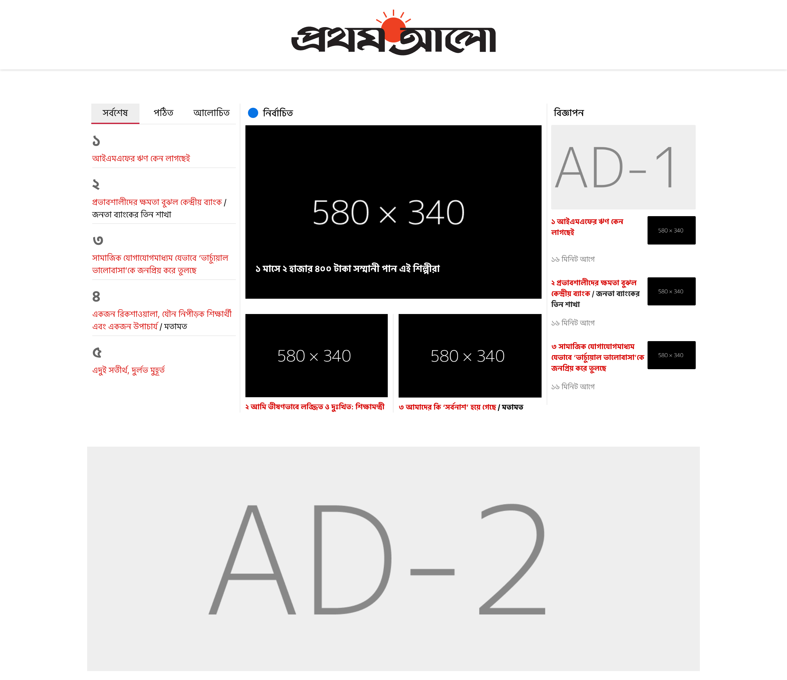

# Prothom Alo Skill Test

# Instructions followed for the project

- Layout with tabs
- Mobile responsive
- JSON data sorted according to sort parameter
- News details page opened according to news id
- Used SCSS for styling
- Atomic design pattern used

# Install node modules

- npm install / yarn install

# In the project directory, you can run:

- npm start
